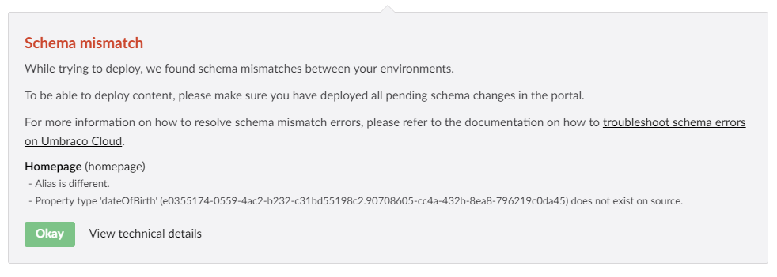

# Troubleshooting Content deployments on Umbraco as a Servivce

## When working locally

If the schema (this includes DocumentTypes, MediaTypes, DataTypes, Templates, Macros and Dictionary items) is different between your local environment and the remote Cloud environment you are deploying to - you cannot do a Content transfer. You will need to deploy these schema updates to ensure that the environments are in-sync before continuing to transfer your content/media (this can contain media from the media section as well).

While Content transfers are done using the Umbraco backoffice, you need to commit the changes to files within the `/data/revision` folder in order to sync the remote Cloud environment. The files in this folder represent the serialized version of the schema (DocumentTypes, DataTypes, etc...), and are deployed through the git repository.

The following articles explains in detail how the deployment process works:

* [Deploying from Local to Cloud](https://our.umbraco.org/documentation/Umbraco-Cloud/Deployment/Local-to-Cloud/)

If you continue to see conflicts between the schema parts that were deployed then please refer to the Debugging section below.

## Debugging

**Note**: If your project is using Umbraco Courier, please refer to this troubleshoot article instead: [Schema Mismatches with Courier](../../Courier/Schema-Mismatch-Courier)

When you run into schema mismatch errors, they will usually look something like this:

In this error message you are able to see exactly which schema mismatches is preventing the content transfer. If you do not have any pending commits in your local Git client there are two ways to go about resolving the schema mismatch:

1. Make a minor change to the schema with mismatches (in the example above it would be the **Homepage** document type), commit and push the change to the Cloud environment
    * This will update your schema on the target environment (the Cloud environment) and ensure it's in sync with the source environment
2. If the mismatches are differences to `aliases` or `names`, changing these manually on the target environment will enable you to transfer your content
