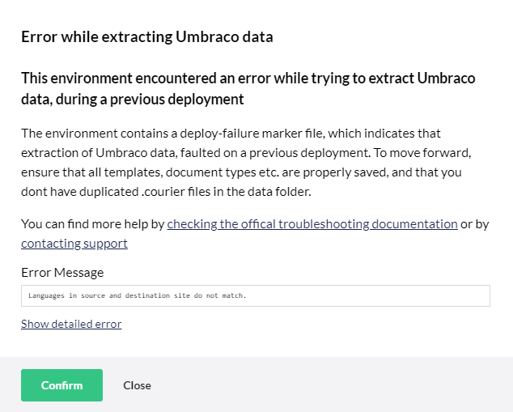

# Troubleshooting languages mismatch

If you are using dictionary items on a multi-lingual setup, you might see errors related to mismatches between languages.

## Cause

This error most often occurs when the default Umbraco language (English-US) is deleted from the backoffice. When creating a new site, or a new environment on a project, said instance will always have the default English-US language added, which could cause your environments to become out of sync.

## Identify the issue

The issue will show up as an extraction error on your Umbraco Cloud environment with a red indicator.

Upon closer inspection, a more detailed error will reveal itself: `Languages in source and destination site do not match.`

This error can occur in two scenarios, and is caused by deleting the default 'English (United States)' backoffice language, while having **dictionary items** present on your project.

If the below conditions are met, you will be presented with the 'Languages in source and destination site do not match.' error:

1. You have at least two languages set in the backoffice

2. The default English-US language is not present amongst your languages

3. Your Document Types are set to "Vary by language"

4. You have some dictionary items on the "source" environment (which would be Live, since new environments are cloned from Live repository)

The first scenario (*Scenario 1*) is when you add a new environment to your project (in most cases it would be the Development environment, though it could happen with Staging as well). In some cases the error shows right after creating the environment, sometimes it appears after the first deployment from that new environment to Live.

The second scenario (*Scenario 2*) is when you create a new project from a baseline, where the baseline would be your project with no English-US language and with dictionary items. Once again, the error might not show up initially, and appear with a later deployment from baseline to child.

## Fixing

In order to fix this issue, English-US should be present on the source environment before creating a new environment/child project.

1. Manually add English (United States) in the backoffice on your source environment (Live)

2. Recreate the environment/child project

3. If you would like not to have the English-US language on your project, now you can safely delete it from the backoffice on both the source and target environments.
