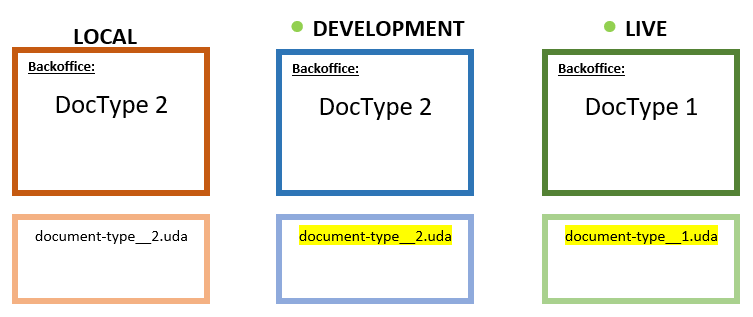
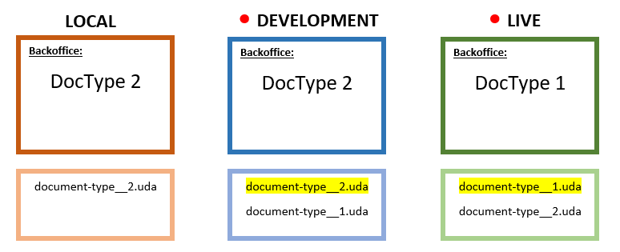
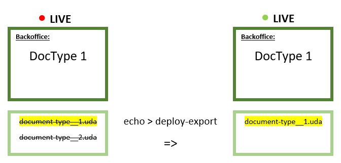

# Troubleshooting structure deployment/restore errors

## Error in files containing site structure

> **NOTE:** If your project is using Umbraco Courier, please refer to this article instead: [Schema Mismatches with Courier](../Courier/Structure-Errors-Courier)

On some occasions, it's possible that you'll encounter collision errors on your Umbraco Cloud environments. This means that two `.uda` files are created for the same entity type. The `.uda` files contain schema for each of your entity types (e.g Document Types, Templates, Macros, Dictionary Items, Datatypes).

Example:

    Some artifacts collide on unique identifiers.
    This means that they have different Udis, yet
    they refer to the same unique Umbraco object
    and therefore cannot be processed.
    ---------------------------------------------
    Collisions for entity type "document-type": 
      Collisions for unique identifier "home":
        UdaFile: ~/data/revision/document-type__4c04d968448747d791b5eae254afc7ec.uda
        UdaFile: ~/data/revision/document-type__f848c577f02b4ee5aea84f87458072a4.uda

In the example above there are two files in the `~/data/revision` folder which contain the same alias, `unique identifier`, for a Document Type. Each file has a different name, but the Document Type they refer to is both `home`. When Deploy tries to create the site structure from these files, it is inspecting each file to try to create a Document Type with a unique alias.

In the case above, there are two files who share the same alias which leads to a conflict: it's impossible for Deploy to know which is the "correct" file, so it gives up and sends an error back.

### Cause

The main cause of this problem is when a Document Type (or Media Type, Data Type, etc) is manually created in two environments using the same alias. 

If you have two or more Cloud environments, we recommend that you never create or make schema changes directly on the Live or Staging environments. You should work with schema only in your Development environment or even better, your local clone of the project.

## Fixing

In order to fix this problem, you will have to decide which of the two colliding Document Types is the correct one. The error message will give you a lot of details you can use in your investigation:

  * The affected entity type (Document Type, Data Type, Member type, etc.)
  * The `unique identifier` (alias)
  * A list of the files containing the same `unique identifier`

Let’s imagine that we have a project with two Umbraco Cloud environments (Development and Live) and a local environment. A Document Type has been created on Live and a Document Type with the same unique identifier has also been created on Development. 

Up until now, this project has been working fine, since no deployments have been made from Development to Live since the Document Type was created on Development.

### Deploying your changes

It’s now time to deploy the newest changes to the Live environment. Since a Document Type with the same alias has been created in both the Development and the Live environment, the deployment will fail.

On a deployment between Umbraco Cloud environments, all the `.uda` files in the `/data/revision` folder will get synced. For this project, this means that both the Development and the Live environments will have two different `.uda` files for the Document Type – the only thing that’s different between the two files are the GUID since they were created in different environments.

**NOTE**: This is when you will see an extraction error like the one shown at the beginning of this article. It is simply not possible to add types with the same alias in the database.

### Choosing the correct UDA file

The next step is to decide which of these Document Types is the correct one. For this project, it’s decided that the Document Type created in the Live environment (DocType 1 and document-type__1.uda) is the correct one.

In order to figure out which of the two colliding `.uda` files are the file for the Document Type created on the Live environment follow these steps:

1.    Access **Kudu** for the Live environment / the environment where the correct Document Type is
2. Use the CMD console (found under the 'Debug console' menu) to navigate to your `site/wwwroot/data/` folder
3.    Remove both colliding `.uda` files from the `/data/revision` folder in the `/wwwroot` folder.
4.    In `/wwwroot/data` run this command: `echo > deploy-export` 
5.    This will generate a `.uda` file for the Document Type, and this will be the correct one
6.    Run `echo > deploy` in the same folder, to make sure everything is extracting correctly

You now know which `.uda` file you want, and it’s time to get the rest of your environments in sync.

### Getting your environment in sync

We strongly recommend that you resolve this locally since this will ensure that the changes you make are added to your Git history.

1.    Clone down the Development environment – or simply do a pull via Git if you already have a local clone
2.    Run the project locally and verify that you get the same extraction error as on your Cloud environments (HINT: look for a `deploy-failed` marker in your local `/data ` folder)
3.    Access the local backoffice
4.    Delete the Document Type from the backoffice
    * If you’ve pulled down a fresh clone of the Development environment, you will need to remove the wrong `.uda` file from the `/data/revision` folder, since you will not be able to see the Document Type in the backoffice because the extraction failed.
5.    Open CMD prompt and navigate to your local `/data` folder
6.    Type the following command: `echo > deploy`
7.    You will now see a `deploy-complete` marker in your local `/data` folder
8.    **Important**: Before you commit and push the changes to the Development environment, you need to access the backoffice of the Development environment and remove the Document Type from there
9.    You are now ready to **commit** and **push** the changes from your local clone to the Development environment, using your local Git client.

When the push from local to the Development environment has completed, refresh the Umbraco Cloud portal and you will see that the Development environment is now green, which means that the extraction error has been resolved.

The final step is to deploy the changes from Development to the rest of your environments, to ensure everything is completely in sync.

### Additional notes

Sometimes you might need to run another extraction on your Cloud environment after deploying in order to get a `deploy-complete` marker in your `/data` folder and turn your environment *green*. To do this, follow these steps:

1. Access **Kudu** on the affected environment
2. Use the CMD console (found under the 'Debug console' menu) to navigate to your `site/wwwroot/data/` folder
3. In the console, type the following command: `echo > deploy`
4. When the extraction is done, you should see a `deploy-complete` marker, which means the extraction error was successful (and the environment indicator will be green on the project page)
