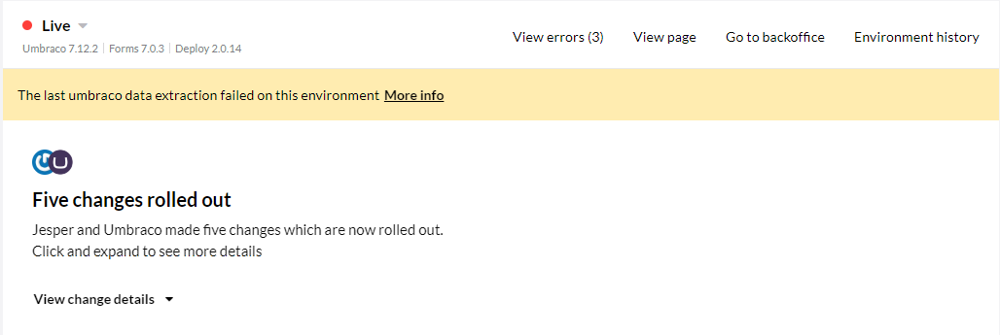
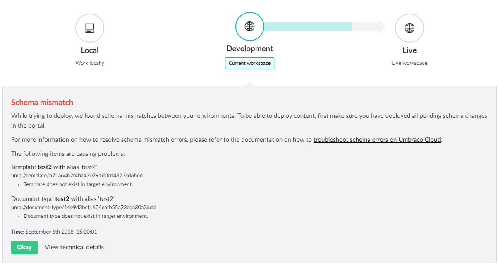
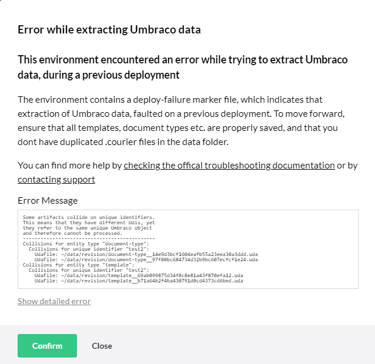

# Troubleshooting

If an error occurs when you are using Umbraco Cloud there are several places that can take place and a lot of possible reasons for it. To help you troubleshoot you should start by determining where this error is reported and what causes the error - is it a deployment error reported in the Portal or maybe an error with a package that gives you an error in the Frontend? The approach you need to follow to fix these errors are very different, so jump to the section that seems right to your issue below:

## [Umbraco Cloud Portal](#the-umbraco-cloud-portal)
An error in the Cloud Portal often looks like this:

## [Umbraco Backoffice](#the-umbraco-backoffice)
An error in the Backoffice often looks like this:

## [Frontend](#the-frontend)
An error in the Frontend often looks like this:

## The Umbraco Cloud Portal
Errors in the Cloud Portal are shown as a colored indicator on an environment. An environment can have three colors:
* __Green__ - this is the "healthy" state where everything is fine
* __Yellow__ - this is the "busy" state that normally occurs when a deployment is in process or an environment is being added
* __Red__ - this is the "error" state which normally has information about what went wrong

**Note:** If an environment is busy or has an error and you try to deploy again it will not be able to, the error will always need to be resolved before another deployment can be started.

What is interesting for Troubleshooting is the Red and Yellow states, Yellow normally doesn't mean an error occured, but sometimes a deployment will get stuck and just keep spinning for a long time without ever finishing - often a browser refresh will reveal this yellow state has switched to red.

#### If you have a red environment what do you do?
The first thing to check is what type of error it is, you can do so by clicking the __**More info**__ button on the state:

We have some guides on how to fix the most common errors below:
* [Collision error](Deployments/Structure-Error)
* [Duplicate dictionary](Deployments/Duplicate-Dictionary-Items)
* [Baseline merge issues](../Getting-Started/Baselines/Baseline-Merge-Conflicts)

If your issue is not covered above here are some general guidelines on what you should do when you have error states on Cloud environments:

The reason an environment is in an error state is that the Umbraco Deploy engine sets markers on the environment, the green one sets a `deploy` marker, the yellow one a `deploy-progress` marker and the red one a `deploy-failed` marker.

Sometimes a deployment will fail due to another deployment in progress, this means you can kick in another deployment later and the deployment will go from failed to complete without needing to do anything extra - read more about [manual data extractions](../Set-Up/Power-Tools/Manual-extractions)!

Often the deployment fails because of an error that won't be fixed simply by redoing it, for that you will need to have a look at the log files - you can check both the regular [umbracoTraceLogs]() and the [deploy logs]().

## The Umbraco Backoffice
Errors in the backoffice can be presented in many different ways, the most common ones are 
* Errors when doing a content transfer / restore 
* A blank page when visiting the backoffice
* Missing sections / trees

#### If the error is during a content transfer / restore:
Start by clicking "View more details", often it will give you a link to a specific article with a guide on how to fix it. We have some guides on how to fix the most common errors below:
* [Schema mismatch](Deployments/Schema-Mismatches)
* [Dependency Exception](Deployments/Dependency-Exceptions)
* [SQL Timeouts](Deployments/Deploy-Settings)
* [Deploy busy]()
* [Media path too long](Deployments/Path-too-long-exception)

If your issue is not covered above, here are some general guidelines on what you should do when you have content transfer / restore errors:

The first thing to ensure is that any schema changes has been pushed through Git or deployed between environments so the environments are in sync. 

Another thing to check would be the log files, relevant information can often be found in the [umbracoTraceLogs]() for both the source and target environments, so make sure to check both.

If you have issues with new user emails / Umbraco Forms emails not being sent it is likely because of your SMTP settings not being set or configured correctly, read more [here!](../Set-Up/SMTP-settings)

#### If the error is something not loading in the backoffice:
This can have many different causes, and as such we don't have specific guides on this, but to narrow it down there are some things you should check:

* Do you have any rewrite rules? Often rewrite rules that are not set up correctly will cause issues with the backoffice, make sure that the following are negated:
    * ^/umbraco 
    * ^/DependencyHandler.axd
    * ^/App_Plugins
    * You can see examples on how to set up rewrites correctly [here](../Set-Up/Manage-Domains/Rewrites-on-Cloud)
* Do you get any errors in your browser console that may help you figure it out?
* Do you get any errors in your umbracoTraceLog?
* If something isn't loading after a package was installed it could be because the package overwrites something like the dashboard.config file - try to turn the package off and see if that helps. 

## The Frontend
Errors in the frontend are presented in three ways:
* YSOD (.Net error page)
* Blank / not loading
* 404 (Page not found)

A **YSOD page** will either show the full error stacktrace or a generic error message if you have customErrors turned off. The full error message can be found in the [umbracoTraceLogs](). Not much more to say about this - if you can't figure out what is wrong when you have the stacktrace, try looking at the namespaces to see if you can figure out what process is throwing errors.

A **blank or not loading page** is likely due to bad rewrite rules - often it will end in a rewrite loop. Make sure you don't rewrite anything on these paths:
* ^/umbraco 
* ^/DependencyHandler.axd
* ^/App_Plugins
* You can see examples on how to set up rewrites correctly [here](../Set-Up/Manage-Domains/Rewrites-on-Cloud)

You should also check your console log in your browser to see if something is failing to load. Finally you can check the [umbracoTraceLogs]() and see if any errors are thrown!

A **404 page** could also be rewrite rules - look above what to check for. Other than that make sure your site and content structure is set up correctly - if you try to access a content node with no template related to it it will throw this error!