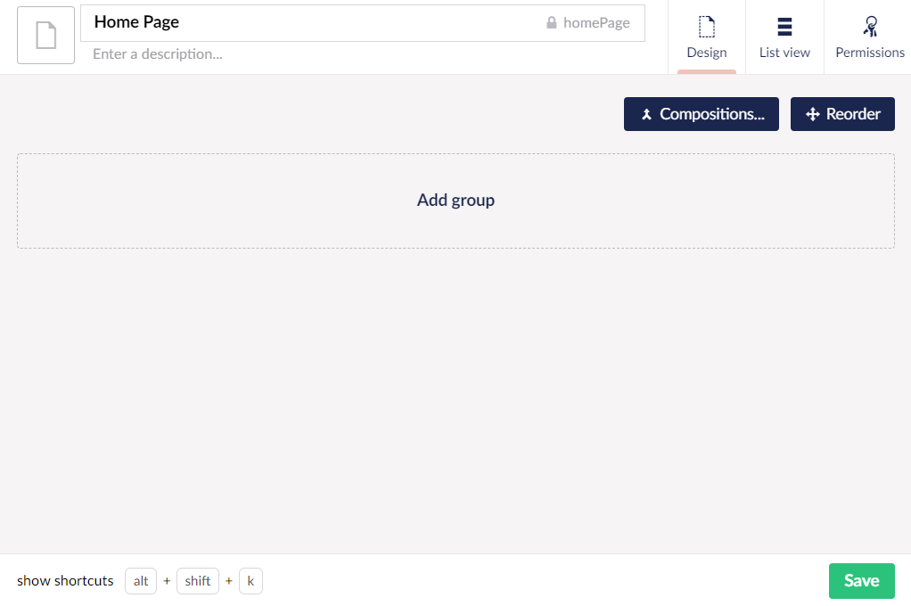
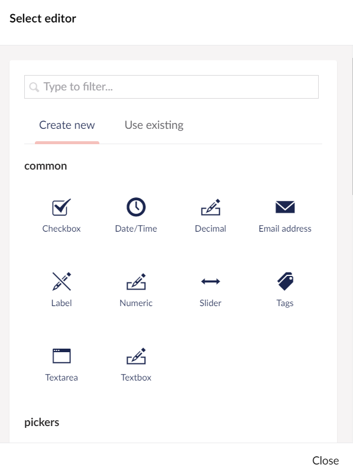

# Creating / Building a Headless project from scratch

In this article you can learn how to get started with your Umbraco Headless project.

It will cover everything you need to know, in order to create your first piece of content in the Umbraco backoffice.

:::note
This guide will assume that you have already [setup an Umbraco Headless project](../../../Umbraco-Headless) without any content.
:::

## Introduction

When you log in to the Umbraco Backoffice, the first thing you will see if the Content section. This is where you will be creating content for your Umbraco Headless project. However, it will not be possible to create any content yet, as we will first need to define the content we are going to be creating.

Content in Umbraco is based on **Document Types** which will define what type of data we can put into our content. A Document Type consists of a set of **Properties** - also called fields. A Property is made up of a **Data Type** which is a custom configuration of a **Property Editor**. Umbraco comes with a set of Property Editors, including a *Text Area*, a *Date Picker*, a picker for media items and many more.

As we go through this tutorial and start builing the content for our Headless project, you will learn more about each of these concepts and how they all work together.

## Chapters / Sections

In this tutorial we will cover the following topic:

* Creating a basic Document Type
* Adding and defining properties
* Creating a Document Type Collection
* Setting permissions on Document Types
* Creating content

## Creating a basic Document Type

Document Types are managed from the **Settings** section in the Umbraco backoffice.

In order to get started with our first Document Type, follow these steps:

1. Right-click on the Document Types folder, or select the three elipses on the right, when hovering the folder.
2. Choose the first option: **Document Type**.
3. Give the new Document Type a name like *Home Page*.
4. Save the Document Type by selecting the green **Save** button in the bottom-right corner.

We have now created our very first Document Type. It's currently a blank slate, and in the next section we will start adding groups and properties in order to be able to add various types of data to our content.

## Adding and defining properties

Before we can start adding properties to the Document Type, we need to add a **Group**.

:::tip
**Property Groups**

Groups are a way to group certain properties together. It can help content editors getting an overview of content nodes with many properties.

Groups also serves as a way to navigate a content node in the Content section.
:::

1. Select **Add Group** in the middle of the Document Type editor area.
2. Give the group a name like *Content*.

Now, let's add our first property to the Document Type.

3. Select **Add Property**.
4. In the *Property Settings* dialog, we'll start by giving the Property a name: *Heading*.
5. (Optional) Give the Property a description
6. Select **Add Editor**

:::tip
**Select Editor**

In this dialog you choose which editor to add to the Property. The editor you choose defines the type of data that can be added to the property.

**Create New** let's you create your own Data Types based on the editors in Umbraco.
**Use existing** provides you with the option to select on the pre-defined Data Types.
:::

7. Use the search field to find and select the pre-defined *Textstring* Data Type.
8. **Submit** the Property settings

We have now added the first Propery to our Document Type.

Following the same steps, let's add a few more properties to the *Content* group:

| Name       | Property Settings        |
| ---------- | ------------------------ |
| Intro Text | *Textarea* Data Type     |
| PromoImage | *Media Picker* Data Type |

With these properties added our Document Type now looks something like this:

This is a very simplified version of a Document Type, and you are welcome to add more groups and properties.

## Creating a Document Type Collection

