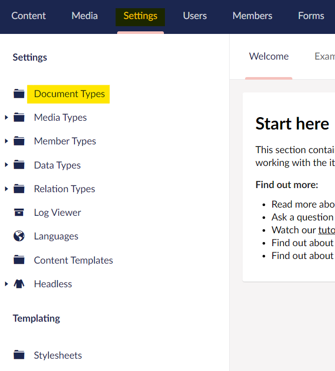
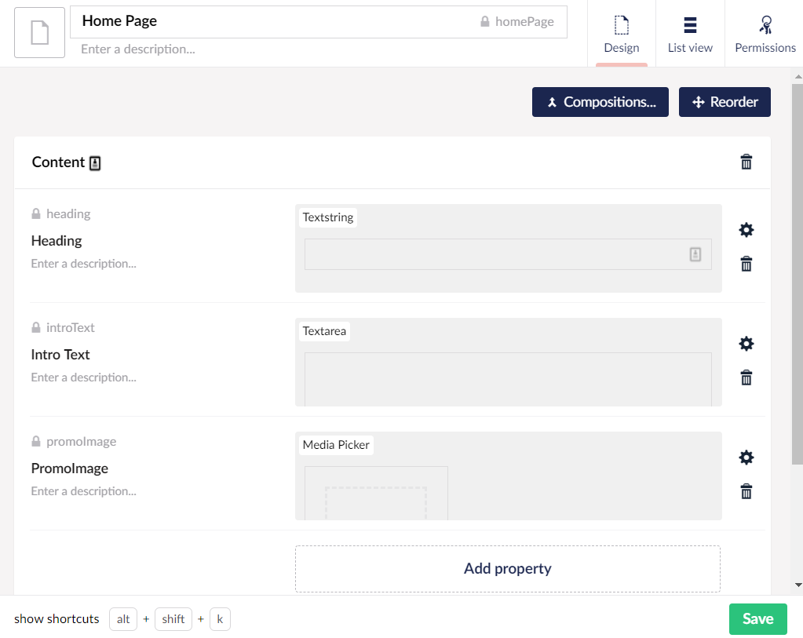
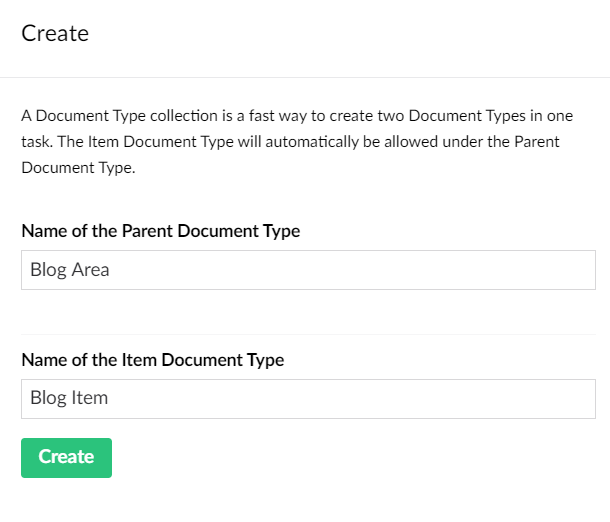

# Creating / Building a Headless project from scratch

In this article you can learn how to get started with your Umbraco Headless project.

It will cover everything you need to know, in order to create your first piece of content in the Umbraco backoffice.

:::note
This guide will assume that you have already [setup an Umbraco Headless project](../../../Umbraco-Headless) without any content.
:::

## Introduction

When you log in to the Umbraco Backoffice, the first thing you will see if the Content section. This is where you will be creating content for your Umbraco Headless project. However, it will not be possible to create any content yet, as we will first need to define the content we are going to be creating.

Content in Umbraco is based on **Document Types** which will define what type of data we can put into our content. A Document Type consists of a set of **Properties** - also called fields. A Property is made up of a **Data Type** which is a custom configuration of a **Property Editor**. Umbraco comes with a set of Property Editors, including a *Text Area*, a *Date Picker*, a picker for media items and many more.

As we go through this tutorial and start builing the content for our Headless project, you will learn more about each of these concepts and how they all work together.

## Chapters / Sections

In this tutorial we will cover the following topic:

* Creating a basic Document Type
* Adding and defining properties
* Creating a Document Type Collection
* Setting permissions on Document Types
* Creating content

## Creating a basic Document Type

Document Types are managed from the **Settings** section in the Umbraco backoffice.

In order to get started with our first Document Type, follow these steps:

1. Right-click on the Document Types folder and choose **+ Create...**.
    * Or select the three elipses on the right, when hovering the folder.
2. Choose the first option: **Document Type**.
3. Give the new Document Type a name like *Home Page*.
4. Save the Document Type by selecting the green **Save** button in the bottom-right corner.

We have now created our very first Document Type. It's currently a blank slate, and in the next section we will start adding groups and properties in order to be able to add various types of data to our content.

## Adding and defining properties

Before we can start adding properties to the Document Type, we need to add a **Group**.

:::tip
**Property Groups**

Groups are a way to group certain properties together. It can help content editors getting an overview of content nodes with many properties.

Groups also serves as a way to navigate a content node in the Content section.
:::

1. Select **Add Group** in the middle of the Document Type editor area.
2. Give the group a name like *Content*.

Now, let's add our first property to the Document Type.

3. Select **Add Property**.
4. In the *Property Settings* dialog, we'll start by giving the Property a name: *Heading*.
5. (Optional) Give the Property a description
6. Select **Add Editor**

:::tip
**Select Editor**

In this dialog you choose which editor to add to the Property. The editor you choose defines the type of data that can be added to the property.

**Create New** let's you create your own Data Types based on the editors in Umbraco.
**Use existing** provides you with the option to select on the pre-defined Data Types.
:::

7. Use the search field to find and select the pre-defined *Textstring* Data Type.
8. **Submit** the Property settings

We have now added the first Propery to our Document Type.

Following the same steps, let's add a few more properties to the *Content* group:

| Name       | Property Settings        |
| ---------- | ------------------------ |
| Intro Text | *Textarea* Data Type     |
| PromoImage | *Media Picker* Data Type |

:::tip
**Media Picker**

This editor let's you upload or select an existing media item from the Media section, and add it to your content.
:::

With these properties added our Document Type now looks something like this:

Remember to save the Document Type by selecting the green **Save** button in the bottom-right.

This is a very simplified version of a Document Type, and you are welcome to add more groups and properties.

## Creating a Document Type Collection

So far, we've created a single Document Type with some text fields and a media picker. Before we start creating the actual content, we are going to add a few more Document Types, to allow for more variation in our Content section.

We will now expand on our site by adding a **Document Type Collection**.

1. Right-click on the Document Types folder and choose **+ Create...**.
    * Or select the three elipses on the right, when hovering the folder.
2. Choose the second option: **Document Type Collection...**.

:::tip
**Document Type Collections**

When working with content you might want to be able to relate certain types of nodes to each other. This could be articles you would like to nest under a News section, or it could be a Blog where it should be possible to create blog posts.

The Document Type Collection allows you to create 2 Document Types in one go, and at the same time, they will be given a parent/child relationship.

Example:
**Parent Document Type**: News Area
**Item Document Type**: News Article

In the Content section, you will with this setup be able to create a News Area content node, and then create your News Articles under that node. 
:::

For our Headless project, we will want it to be possible to create blog posts under a blog area.

3. Name the Parent Document Type *Blog Area*.
4. Name the Child Document Type *Blog Post*.
5. Select **Create** to setup the two Document Types.

Once the Document Types have been created you will be redirected to the Item Document Type - in our case the *Blog Post*.

Following the steps outlined earlier in this tutorial, add a *Content* group and a few properties to both the *Blog Post* and the *Blog Area* Document Types.

**Blog Post**

| Name        | Property Settings           |
| ----------- | --------------------------- |
| SubTitle    | *Textstring* Data Type      |
| MainContent | *Richtext Editor* Data Type |

**Blog Area**

| Name            | Property Settings        |
| --------------- | ------------------------ |
| BlogDescription | *Textarea* Data Type     |

## Setting permissions on Document Types

## Creating content