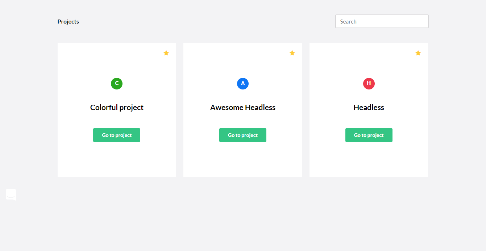
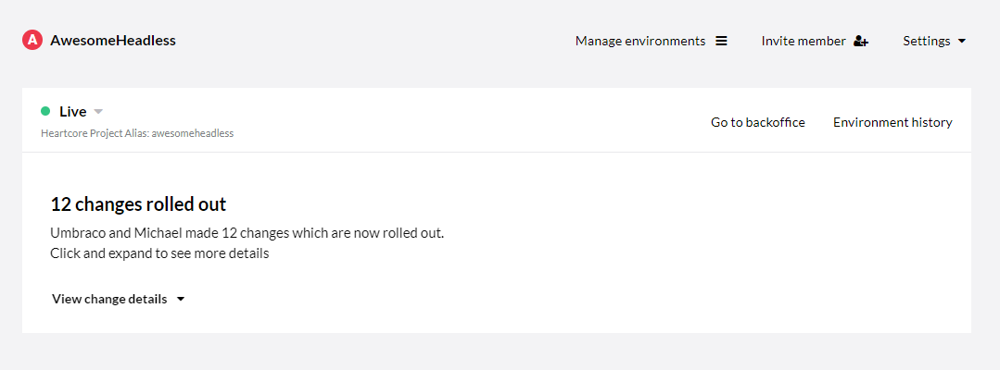
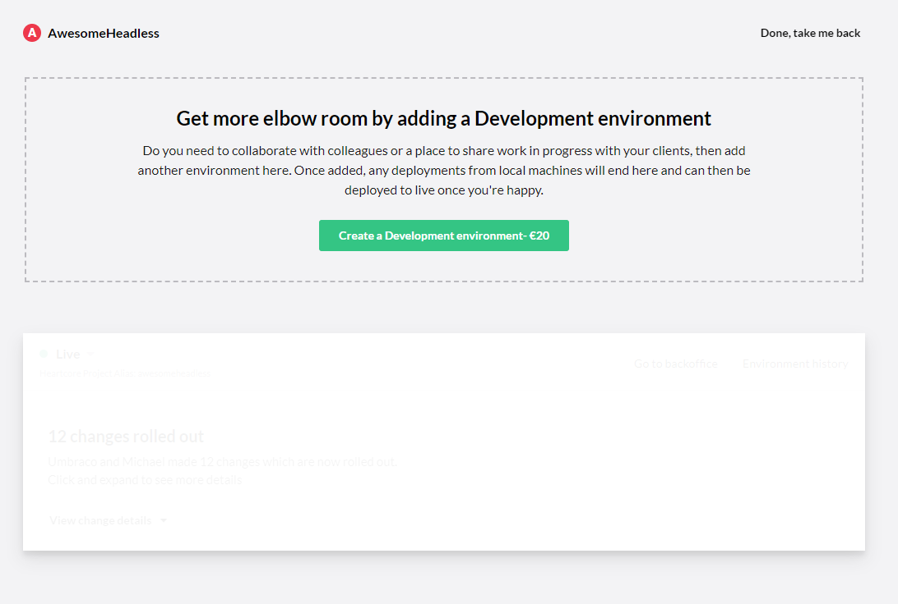
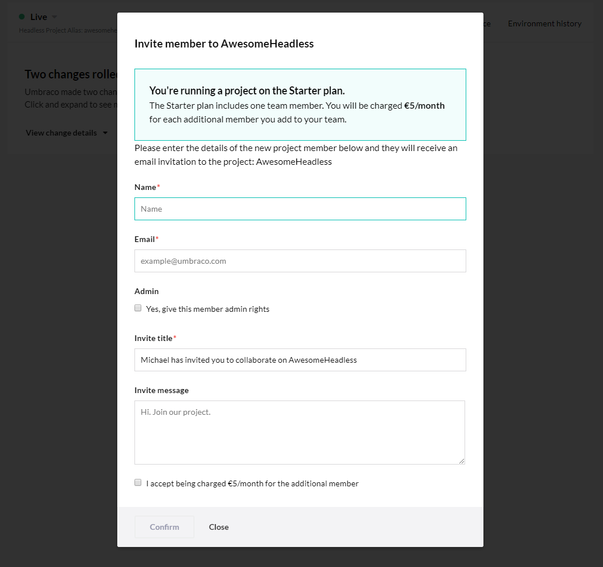
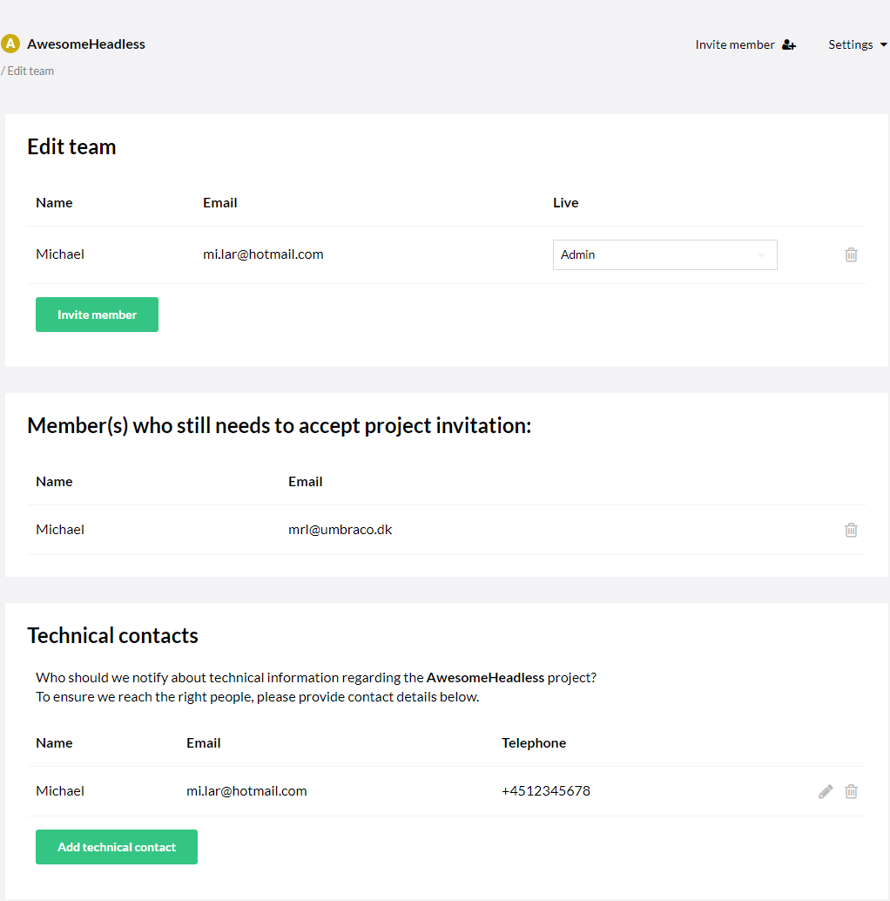
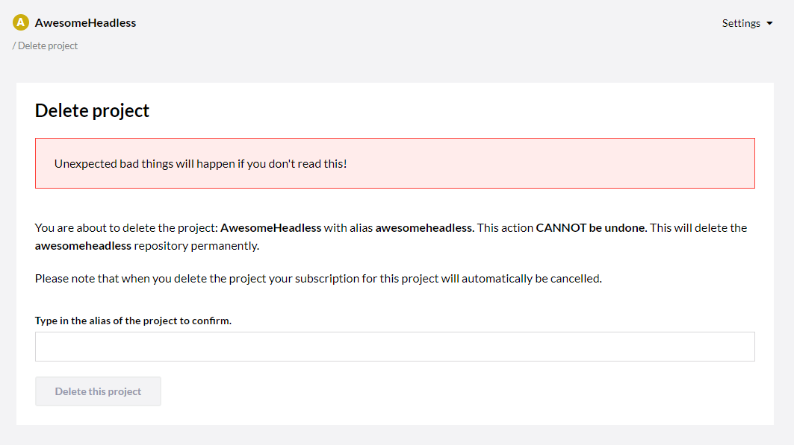
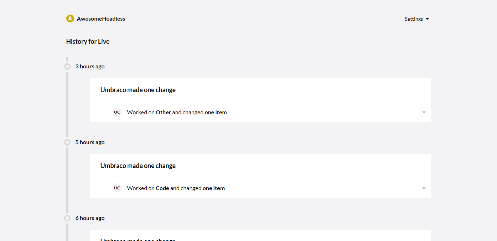

# The Umbraco Heartcore Portal

After you have logged into the Cloud Portal you are presented with the project overview.

From here you can see a list of all your projects. If you have many projects, you are able to search for specific projects from the search bar in the top right corner.

Clicking on a project will take you to the project where you will get an overview of your environment(s).

## Manage Environments

From here you are able to create multiple environments so you might have a Development environment as well. Depending on what plan you have chosen, you will have acces to one or more environment on your project.

If you want to add an environment all you have to do is click the big green button. Umbraco will create the environment for you.

When you are done you can go ahead and click on 'Done, take me back' in the top-right corner to get back to the project overview.

## Invite member

In the top-right corner you will find the **invite member** option. This will allow you to quickly invite new team members to your project from a modal that pops up. This makes it very fast and easy to invite new team members. Depending on your chosen plan, you might be charged an extra €5 euros per added team member.

## Settings

Right next to the invite member option. you will find the **Settings** dropdown menu. Here you will find various links to more management and configuration options.

### Edit Team

As with the **invite member** option you are able to add new team members to your project. You will also be able to remove team members from this page as well as see any pending invitations you might have sent.

It is also here you are able to add the Technical Contact information such as Name, Email and a telephone number.

### Webhooks

Here you are able to set up a webhook that will gather all the information related to deployments. This information is very useful if you har set up something like Slack integration so every time a deployment has been made a message will be posted.

The webhooks that can be added here is not the same as the webhooks that can be created from the Backoffice.

### Upgrade plan

Here you will be able to upgrade your trial to a plan that fits your needs.

### Rename project

Here you are able to rename your project. All default umbraco.io hostnames will be updated to match the new name. Also note that all clone urls will be updated to match the new projectname. If you have local git repositories remember to update the urls.

### Delete project

From this page you can delete your project. When deleting the project your subscription will automatically be cancelled as well. Deleting the project is a **permanent action**.

## Go to backoffice

Clicking on the 'Go to backoffice' link will open up a new tab with the login screen for the Backoffice. If you would like to learn more, you can read our documentation for the [Heartcore Backoffice](../The-Headless-Portal).

## Environment history

Here you will be able to see a timeline of your projects environment where you will get a detailed description of what changes that has been made.

