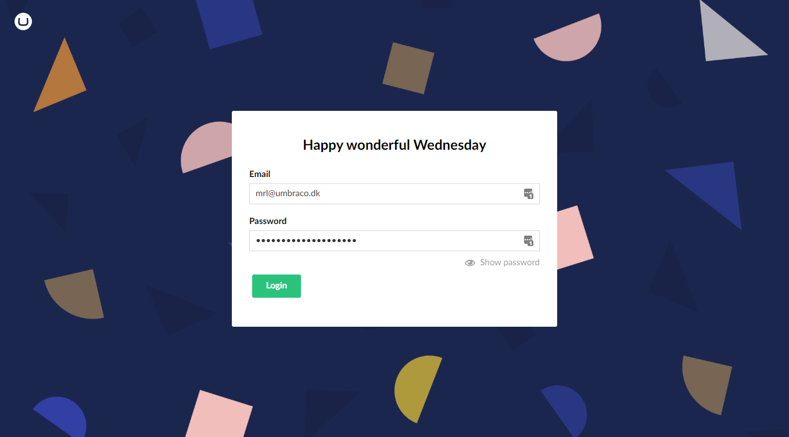
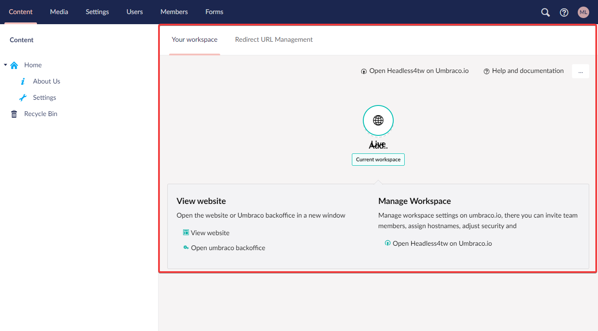
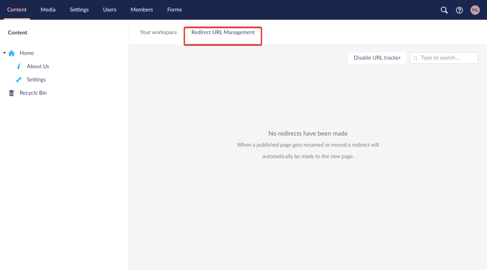

# Tour of the Umbraco Backoffice

In this article you will get an introduction to the different sections in the Umbraco Backoffice.

## Login screen

When you go to the backoffice of your Umbraco Headless project you will be asked to log in.

From here you are able to log in with the credentials used when the project was created.

## Sections

The backoffice is devided in specific sections e.g. Content, Media and Settings. This will allow you to do work related to a specific sections of Umbraco.

The sections menu is located in the top-left corner of the screen.

## Section Tree

Every section has a section tree that gives you an overview of the content you have in each section.

Folders and nested content can be expanded by clicking the arrow next to the node. This can also be done by double-clicking on the node.

### Nodes

Every item you have is considered a node. It could be a media item or content in the content section.

## Dashboard

Every section in the Umbraco backoffice has a default dashboard associated with them. The first thing you will see when accessing the backoffice on your Umbraco Headless project is the "Welcome" dashboard, where you can find links to news and resources useful to your project. 

The Dashboard is where you can see what environment you are currently working on and you will also be able to navigate to the front-end of your headless project as well as navigate to the project on Umbraco.io.

Should you have set URL redirects you can manage them via the Redirect URL Management tap.

## Content

In this section you will find all the content you have on your page. Each item in the tree is called a content node. Every node is made up by different fields. Each field is defined by a document type.

## Media

Media items are used to store images and videos in the Media section. These items can be referenced from your content. You are also able to create folders in the Media section to keep all your Media Items sorted.

## Settings

In the settings section you find the before mentioned Document Types, Data Types and Media Types among other settings that will be covered below.

### Document type

Document types helps define the content nodes in the content tree that the user can create. A document type has different properties that in turn is made up by a specific Data Type like text or a number. A property is the fields that holds the content in a content node that can be edited by the content editor.

### Media Types

What differs from Document Types is that Media Types are specifically made for media items in the Media section.

### Member Types

When you have a website with a login you can create member types. Umbraco comes with a standard Member Type but you can also create your own type for a more personalized member.

### Data Type

Each Document Type property consists of a Data Type which defines what kind of input the property holds. Each Data Type references a Property Editor which is configured in the Settings section of the Backoffice. A Property Editor can be anything from a basic number to something more complex like an image-cropper. It is possible to have multiple Data Types with different settings that still uses the same Textarea Property Editor.

### Relation Types

In this section you are able to create two way relationships and query the parent for the children and the children for the parent.

### Log Viewer

The log viewer is a view where you can go through all your logs. You are able to filter on warnings, errors or critical Log Types to name a few.

### Languages

Here you will be able to manage your language variants. Depending on what plan you have chosen you will be able to have more that one language.

### Headless

The Headless node in the Settings tree is unique as it is only featured in Umbraco Headless. From here you will be able to manage the APIs as well as create and manage your Webhooks.

-   API Browser: In the API Browser you are able to test your API end-points. You can read more in the [API Browser article]()

-   Webhooks: You are also able to create and manage your Webhooks in the settings. You can read more in our [Webhooks article]()

## Users

IN this section you can manage all the users that are currently working on the project. Users are not to be confused with Members as members are people who has a login to your websites front-end whereas Users can be developers, content creators etc that is working on your project from the backoffice.

You are also able to segment your user into different User Groups. You can add Users to existing Groups or create your own custom Member Groups.

As a special section for the Headless Backoffice is the ability to create, manage and revoke API Keys for the Users working on the project.

## Members

The Members section is where you manage your members who are able to log into your projects front-end. You can create Member Groups for easy management if you have multiply types of memberships etc.

## Forms

In this section you are able to create and manage your Umbraco Forms. You are able to extract the data that has been stored in the Forms as well. You will have to buy a licnese for Umbraco Forms to be able to work with it on Cloud. You are able to install Umbraco Forms locally to test it out as well.
