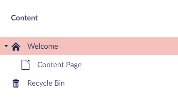

## MVC Sample

In `/samples/Umbraco.Headless.Client.Samples.Web/` you will find a .NET Core 2.2 based MVC website implementation. It presents one possible approach to creating a website using Umbraco Heartcore for Content Delivery.

The sample is built up around a sample Heartcore project with the alias `demo-headless`. You can choose to test the sample with the sample project or connect the sample to your own Heartcore project.

### Prerequisites

- [.NET Core SDK 2.2](https://dotnet.microsoft.com/download/dotnet-core/2.2)

### Run the sample on your local machine

Before running the sample you will need to define which Umbraco Heartcore project you want to fetch content from.

- Open the `application.json` found in `samples/Umbraco.Headless.Client.Samples.Web/Umbraco.Headless.Client.Samples.Web/`
- Add your project alias or use the alias of the sample project, `demo-headless`

```
{
    "Umbraco": {
        "ProjectAlias": "demo-headless",
        "ApiKey": ""
    }
}
```

The `ApiKey` can be left blank when using the `demo-headless` sample project. If your testing with your own Heartcore project and have chosen to protect the content exposed via the Content Delivery API then you will need an API-Key. It is an option that has to be actively turned on via the Umbraco Backoffice in the Headless tree in the Settings section. Read more about that in the [Backoffice users and API Keys article](../../Getting-Started-Cloud/Backoffice-Users-and-API-Keys).

The MVC sample can be run in one of two ways:

**1. Use the command line**

This is done by running the following two commands in the `Umbraco.Headless.Client.Samples.Web` folder:

```
> dotnet restore
> dotnet run
```

The first command will restore the packages and the second will run the site.

**2. Using an IDE**

Run the application in Visual Studio or Visual Studio Code by hitting `F5`.

### Show your content

For the following section, as Heartcore project with the following content structure will be used:



When you've connected the MVC sample to your own Umbraco Heartcore project you will be presented with a page showing the properties and the data from the content node at the root of your website. This is because we need to define which view or controller should be used for the content on our project.

This can be done in two ways: Define a view file using the Document Type alias or build a controller using the already defined UmbracoController.

**Define a view file**

1. Create a `homePage.cshtml` file in `Views/DefaultUmbraco` - the name of the file should be the alias of the Document Type the root content node is using
2. Set `Umbraco.Headless.Client.Net.Delivery.Models.Content` as the model
3. Set layout to `null`

```
@model Umbraco.Headless.Client.Net.Delivery.Models.Content
@{
    Layout = null;
}
```

When you build the solution and start it up, this view file will now be used as the frontend.

**Build a controller**

1. Right-click the `Controllers` folder in Visual Studio and select *Add > Controller...*
2. Select *MVC Controller - Empty*
3. Use the alias of the Document Type used on the root content node for the name of the controller, e.g. `HomePageController`
4. Set the controller to use `UmbracoController` 
5. Set the `Index()` action to return `UmbracoContext.Content`

```csharp
using System;
using System.Collections.Generic;
using System.Linq;
using System.Threading.Tasks;
using Microsoft.AspNetCore.Mvc;
using Umbraco.Headless.Client.Samples.Web.Mvc;

namespace Umbraco.Headless.Client.Samples.Web.Controllers
{
    public class HomePageController : UmbracoController
    {
        public HomePageController(UmbracoContext umbracoContext) : base(umbracoContext)
        {
        }

        public IActionResult Index()
        {
            return View(UmbracoContext.Content);
        }
    }
}
```

Now, all we need to an index view file in `Views/HomePage` in order to render the frontpage of the Umbraco Heartcore project.

### Building view files

In order to render out the properties on our content we need to use the `@Model.Value("")` approach, where the value will be the alias of the property you want to display data from. 

An example could be a textstring property with the alias `heading`. To render the data from this propery on the frontend, we will need to use `@Model.Value("heading")`.

Below is a full example of how a basic view for a root node could look.

```html
@using Umbraco.Headless.Client.Net.Delivery.Models;
@model Umbraco.Headless.Client.Net.Delivery.Models.Content
@{
    Layout = null;
}

<!DOCTYPE HTML>
<html>

<head>
    <title>@Model.Name</title>
    <meta charset="utf-8" />
    <meta name="viewport" content="width=device-width, initial-scale=1, user-scalable=no" />
</head>

<body>

    <h1>@Model.Value("heading")</h1>

    <div>

        <p>@Html.Raw(Model.Value("bodyText"))</p>

        ("promoImage")?.Url)?width=300" />

    </div>

</body>
</html>
```

HTML is used to build the general structure of the article, while we use Razor to render data from our Umbraco Heartcore project.

## References

The .NET Core