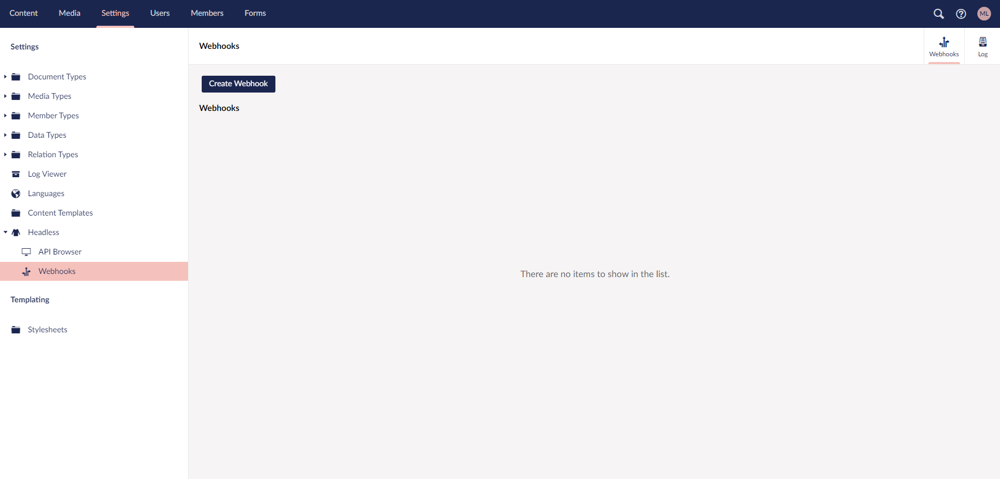
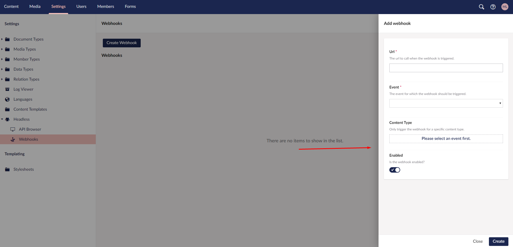
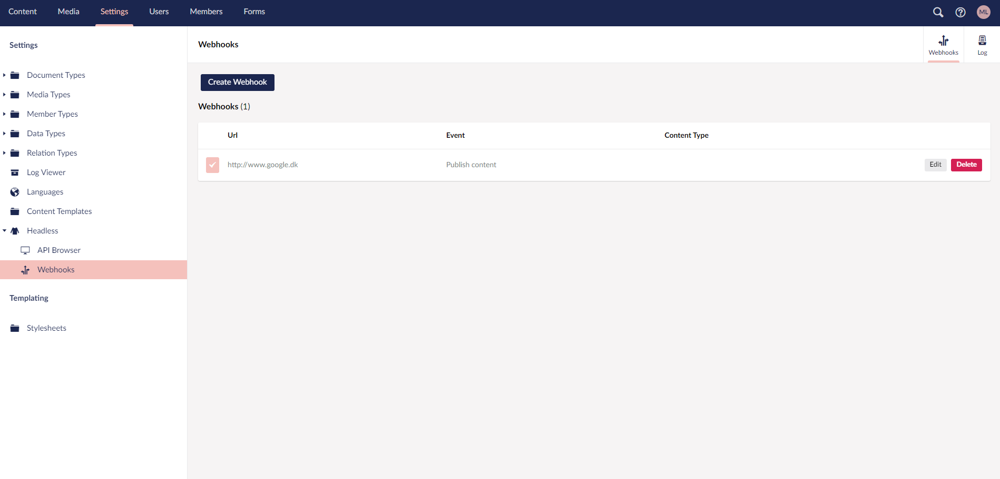

# Webhooks

In this article you will learn more about how to use Webhooks, and how to set them up.

Webhooks from the backoffice works the same way as the webhooks from the portal. 

## Usage

A great example of when to use webhooks would be if you have a website created with a static page builder.

By adding a webhook to a specific URL and selecting an Event Trigger you are able to automatically update the website by sending the data from the webhook to the static page builder.

## Setting up a webhook

From the Webhooks menu under the Settings section you can create and manage your webhooks.

Clicking the Create Webhook will open the cration menu on the right side.

From here you add the URL that the webhook will call and select the Event that should trigger the webhook. Lastly you can choose a Content Type you wish the webhook to trigger on.

Do note that you will have to choose the type of event first and this field is not mandatory.

Once the webhook has been created you can manage it from the list.

