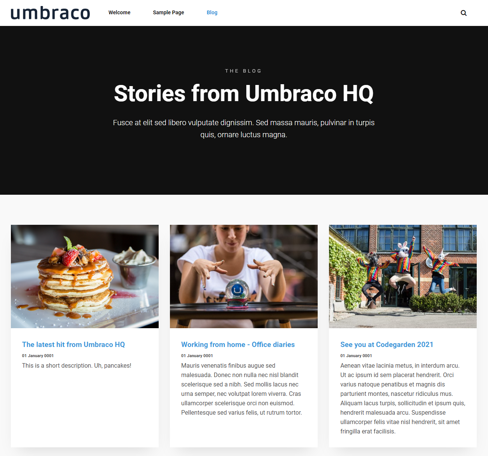
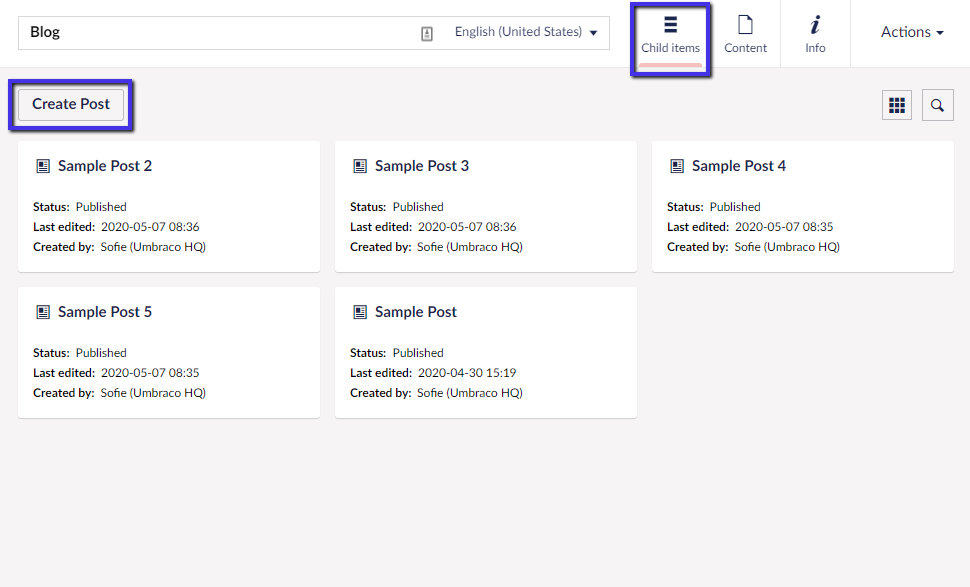

# Feed

Many websites requires a new section or a blog or sometimes even both. With Umbraco Starterkit that can be achieved used the **Feed** content type. Once a Feed has been setup, **Posts** can be created as child elements or subpages - these could be anything from blogposts to news articles.

Below is an example of a feed page with a Hero widget and a feed with 3 posts.

Besides being a feed-archive for posts, the Feed content type also has a Content tab with a set of groups similar to the ones found on the Site and the Page content type:

* Content group for adding widgets (these will appear before the feed)
* [SEO](../../Settings/Specific-Settings/#seo)
* [Settings](../../Settings/Specific-Settings/#settings)

## Post

The Post content type is used to create the subpages/posts in a feed.

To create a post using the Post content type, a Feed must already be setup. With that in place, posts can be created from the *Child Items* tab on the feed.

Posts are created through the Feed content type, using the "Create post" feature on the Child items tab.

The Post content type provides the following groups of options:

* [Content](#content)
* [Meta](#meta)
* [SEO](../../Settings/Specific-Settings/#seo)
* [Settings](../../Settings/Specific-Settings/#settings)

### Content

### Meta
