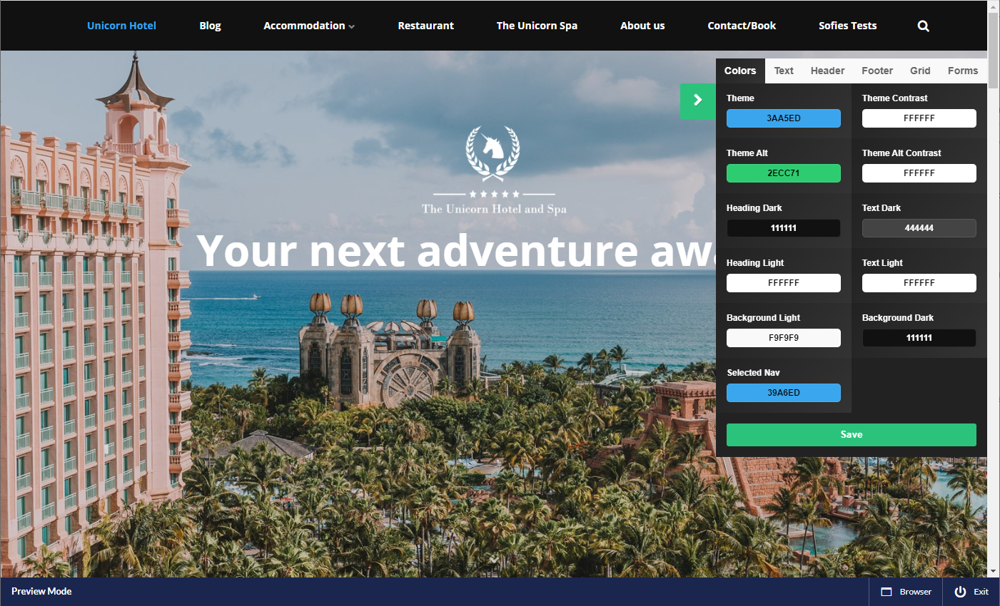

# Themes

Umbraco Uno provides a lot of features and options designed to customize your website to be exactly what you need it to be.

----------
This article should contain a bunch of different information about how to customize an Umbraco Uno project.
Things this article should cover:

* The Theme Editor
* Theme settings page
* Colors and fonts
* Logos
* Customize grid

**NOTE**: All screenshots in this article needs to be replaced with screenshots of the sample content once it's made.

----------

In this article you will find more information about how to work with themes, fonts and colors in your Umbraco Uno project.

## Theme Editor

When you're previewing the content you're working with, you can use the **Theme Editor** to change colors on the website, set different fonts for the headings and text as well as costumize various other aspects of the website.

To access the Theme Editor, follow these steps:

1. Select a piece of content from the Content tree
2. Use the *Preview* feature at the bottom of the page
3. Access the Theme Editor by selecting the green pencil-button in the right side of the screen

The Theme Editor contains the following sections:

* **Colors**: Define the colors being used throughout the website
* **Text**: Change the fonts used for headings and the main body of text
* **Header**: Customize how the header of the site should look
* **Footer**: Change the theme and size of the Footer
* **Grid**: Define various size-dimensions for the Grid widget
* **Forms**: Set the border radius for buttons in forms on the website
