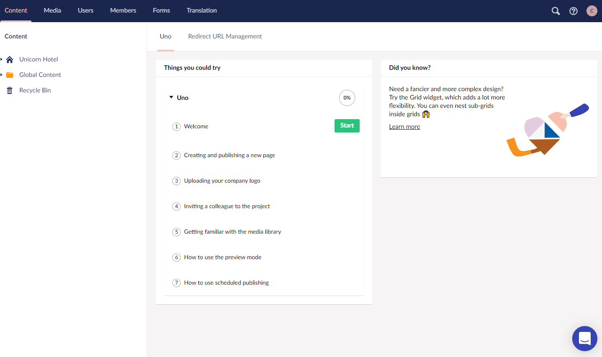

# Tour of the Backoffice

-----

The Umbraco Backoffice is the first meeting you will have with your new Umbraco Uno project. This is the platform you will be working on when creating content, adding images and media and preparing your website to be published.

This article aims to give you a better understanding of each of the sections in the Umbraco Backoffice, as well as enabling you to navigate the various Umbraco-specific lingo that you might encounter.

Each section in the Umbraco Backoffice is described in more detail in the Uno-pedia: [Umbraco Backoffice](../../Uno-pedia/Umbraco-Backoffice).

## Backoffice sections

The Umbraco Backoffice consists of a number of **sections**, each with a specific purpose. All sections are available at all times from the purple **sections menu** in the top, where the section that's currently being visited will be highlighted.

In the right side of the sections menu you will find a search option, a **Help section** and **Profile menu**.

### Main sections

6 main sections are available in the backoffice of an Umbraco Uno project.

1. There's a section where you can manage all **Content** on the website.
2. In the **Media** section you can manage all uploaded media items like images and videos.
3. Invite new users into the backoffice and manage existing users from the **Users** section.
4. When you're working with restricted areas on your frontend, use the **Members** section to manage who can access that area.
5. Create and manage contact forms or signup forms from the **Forms** section.
6. When you're creating a multilingual website, make sure to also update the default dictionary items in the **Translation** section.

See the [Umbraco Backoffice](../../Uno-pedia/Umbraco-Backoffice) section in the Uno-pedia for more indepth descriptions and details on each of the sections.

Each of the main sections consist of two areas: a **Section Tree** and a **Dashboard**/**Workspace** area. These are described in more detail further down this article.

### Help section

The Help section provides a set of resources designed to aid you in various tasks that you might need to perform when working with Umbraco Uno.

Each of the **Tours** will take you through a detailed step-by-step guide on a specific task. The amount of Tours added will be updated frequently, and is a resource we highly recommend that new Umbraco users uses.

In the Help section you will also find links to other resources such a this documentation and video material on [Umbraco.TV](https://umbraco.tv).

### Chat support

You will be able to reach our support channel, by clicking the blue bobble in the bottom right corner, here you can also search for articles, and see the status on all systems.

### Profile menu

The Profile menu provides the option to logout, as well as a few shortcuts to edit the current user.

Users are managed in the **Users** section. Learn more about users and how to manage them in the [Manage Users](../../Manage-users) section.

## Section Tree

The Section Tree makes up the left side of each main section, and is a menu/list of the available items and workspaces in that section.

In the Content section it will list all the created content, in the Media section it will list all the uploaded media items and in the Users section all existing users and User Groups will be listed.

## Dashboards and Workspaces

Each section in the Umbraco Backoffice contains at least one **Dashboard** displaying information relevant to that section.

The "Welcome" dashboard in the Content section will display a lot of resources useful for working with Umbraco Uno. In the Users section a dashboard will provide an overview of users who have access to the project and in the Forms section the dashboard displays an overview of the number of entries for each form.

When editing a piece of content, an image or creating a new Members group the area next to the Section Tree will be used as a **workspace** instead of a dashboard. The workspace will contain all the options needed for the specific task, and in many cases the workspace will consist of multiple tabs, which will be accessible from the top-right side of the workspace.
