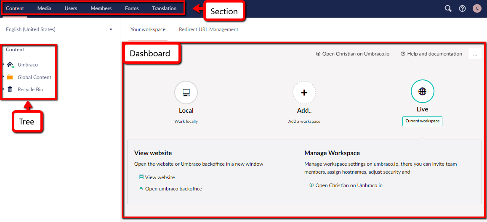

# The Umbraco Backoffice

This is an article about the backoffice, and is design around giving you a deeper understanding of what the backoffice is.

## What is a Backoffice

The Backoffice is the counterpart to the Frontend. It is in the backoffice that you create all of your content, which is done in the Content section of the backoffice.
The backoffice is built of multiple areas. There's the tree on the left, the dashboard in the middle, and the sections at the top. To learn more please read [the Getting started guide for the backoffice](../../../Getting-Started/Backoffice/index.md).
The backoffice also lets you control what your users can do and you can change settings for your users and members.
Essentially the backoffice works as your main workspace when creating and managing things in your Umbraco Uno project.

### Tree

The tree is a list of multiple items, it could be media items or content items.
The tree is always located to the left of the Dashboard.

### Node

A node is an item in the tree list. What a node is changes depending on what section you are in. 
For example, in the Content section a node would be a piece of content or a page, and in media, it would be an image or a folder.

### Dashboards/Workspaces

The dashboard is located in the middle of the screen for each of the sections.
The main function of the dashboard is to show you important information.
It is worth noting that the dashboard will be transformed into your workspace when working with content and media.
To switch between workspace and dashboard you can click nodes for  workspace and the field saying "content" in the top of the tree.

## The Sections

The backoffice is divided into sections you will see this in a menu bar in the top of the page. The sections are as follows:

- [Content](#Content)
- [Media](#Media)
- [Users](#Users)
- [Members](#Members)
- [Forms](#Forms)
- [Translation](#Translation)

Here we will get in-depth with what each section offers you in tools.
You will do the majority of your work from the Content sections, however, some tools may only be used on certain sections such as creating a new form for instance.

### What it looks like

### Content

The content section is where you generally work with your content, it utilizes a content tree which can be found on the left side of the screen. The content tree is built from your content nodes, these nodes are items in your tree.

### Media

The media section is where you can handle all of your images and videos. The way it works is that you can create a folder for your media files if you want, by pressing the button in the left top of the dashboard that says “create”.
When you have created a folder, you can open the folder and then you drag the images, from your local machine into the folder, and voíla its in your media library.
On the left side of the screen, you can see your entire media library.
There is much more to learn about [Media](../../Creating-Content/Manage-Media-library/index.md).
### Users

The users section handles all of the backoffice users that have been invited to the backoffice by the owners. Here you can change what permissions the users have such for example read-only users.
What sections they should have access to is also up to you, and you can choose that by creating a group for the users that only have access to the sections you want them to.
You can get a deeper knowledge about [Users](../../Manage-users/index.md) by following this article.

### Members

The members section handles members which are not to confuse with users, members are people that sign up to your site via the register widget.
This means that the members are your “customers” and users are your “workers”.
You can choose to create members manually as well, from the members section you will be able to fix their passwords or what other management might be needed there.
If you want to learn more about [Members](../../Manage-users/index.md), you can do so by following this article.

### Forms

The Forms section lets you create forms to use in your content section.
You can read more about forms and how to create them here [Umbraco Forms](../../../UmbracoForms/index.md)

### Translation
