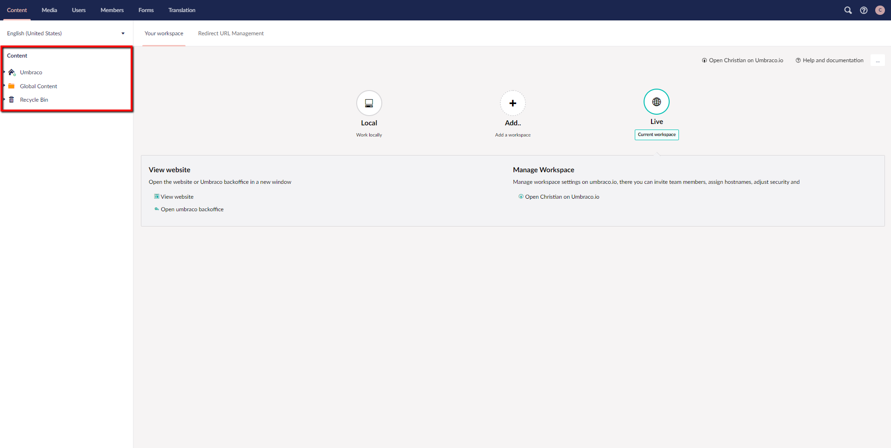
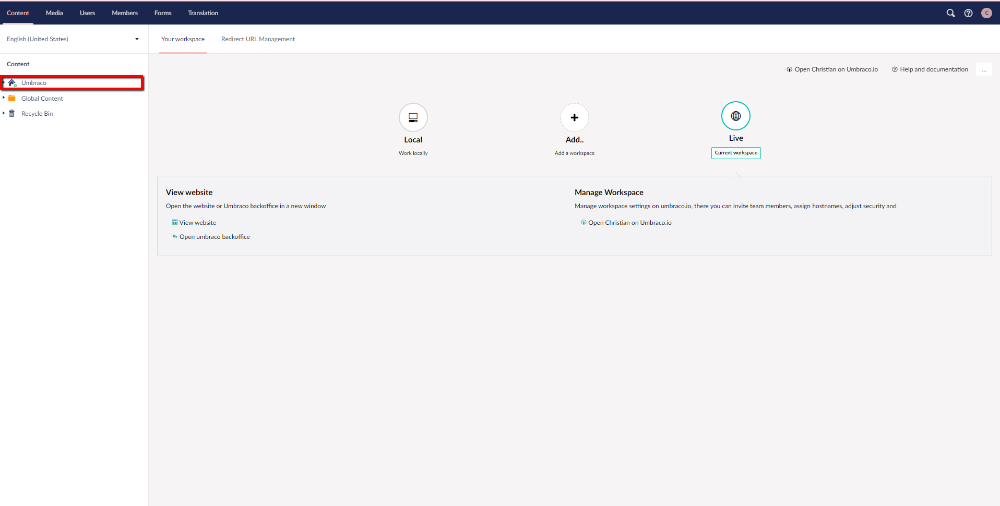
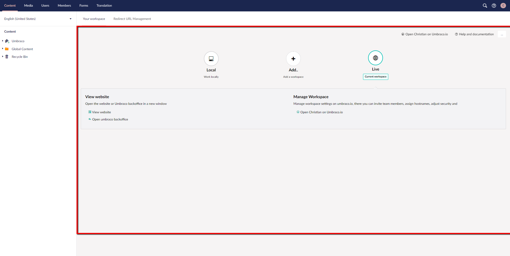
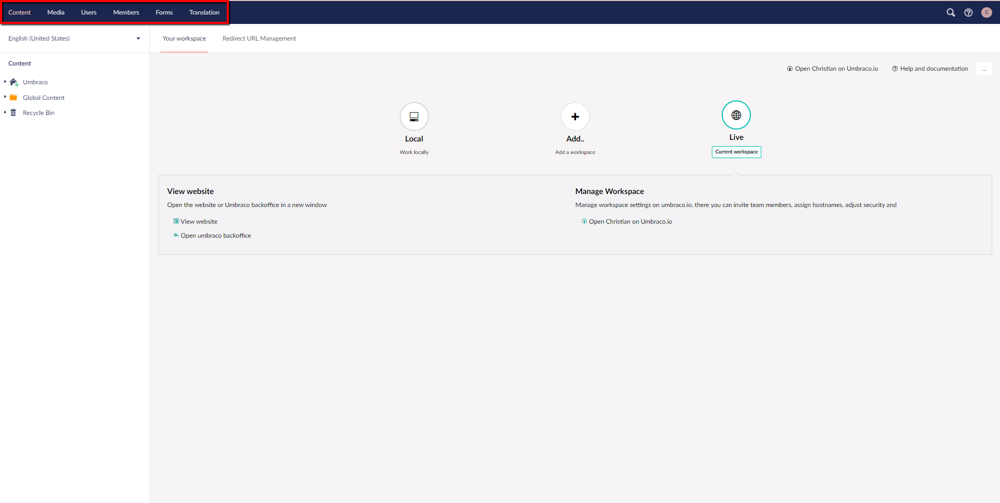

# The Umbraco Backoffice

This article should serve as an entry point to learning more about the various sections and tree in the Umbraco backoffice.

It should go hand-in-hand with the "tour of the backoffice" that's here: (../../Getting-Started/Tour-of-the-backoffice).

## What is a Backoffice

The Backoffice is the counter part to the Frontend, it is in the Backoffice that you can create all of your content, this can be done in the content section of the Backoffice.
A Backoffice is bild of multiple areas, theres the tree on the left, the dasboard in the middle. the sections in the top to learn more please read (insertlink)

The Backoffice also lets you control what you users can do and you can change settings for your users and members.

Escentialy the backoffice works as your main workspace when creating and managing things in your Umbraco Uno project.

The Backoffice is divided into sections you will see this in a menu bar in the top of the page, These sections are as follows:

- Content
- Media
- Users
- Members
- Forms
- Translation

### Tree

The Tree is a list over multiple items, it could be media items or content items.
The tree is always located to the left of the Dasborad.

### Sample

### Node

A Node is an item in the tree list, what node is changes depending on what section you are in, for example in the content section a node would be a piece of content or a page, and in media it would an image or a folder.

### Sample

### Dashboards

The Dashboard is located in the middle of the screen for each of the sections.
The main function of the dasboard is to show you important information.

### Sample

## The Sections

Here we will get in depth with what each section offer you in tools.
You will to the majority of you work from the content section, however some tools may only be used on certain sections such as creating a new form for instance.

### Sample

### Content

The content section is where you generally work with your content, it utilizes a content tree which can be found on the left side of the screen. The content tree is built from your content nodes, these node are items in your tree.

### Media

The Media section, is where you can handle all of your images and videos, the way it works is that you can create folder for your media files if you want,  by pressing the button in the left top of the middle field that says “create”.
When you have created a folder you open the folder and then you drag the images from your local machine into the folder, and voíla  its in your media library.
On the left side of the screen you can see your entire media library.

### Users

The Users section handles all of the Backoffice users that has been invited to the Backoffice by the Backoffice owners. Here you can change what permissions the users have such for example read only users.
What sections they should have access to is also up to you, and you can choose that by creating a group for the users that only have access to the sections you want them to.

### Members

The Members section handles members which is not to confuse with users, members are people that sign up to your site via the register widget.
This means that the members are your “customers” and users are your “workers”.
You can choose to create members manually as well, from the members section you will be able to fix their passwords or what other management might be needed there.

### Forms

The Forms section lets you create forms to use in your content section.
You can read more about forms and how to create them here (Insert link)

### Translation

