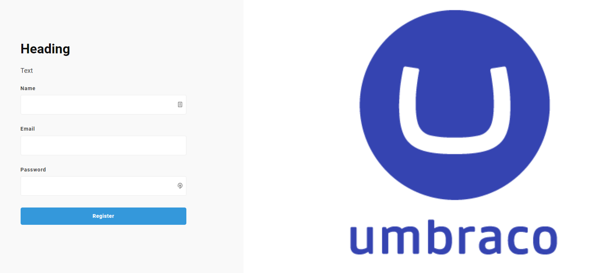
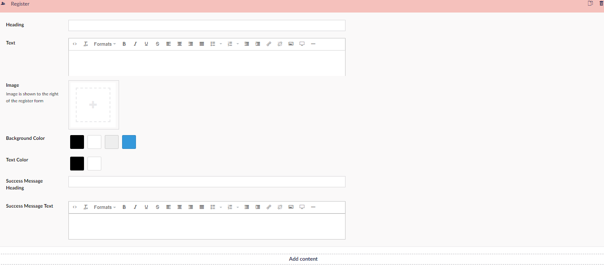
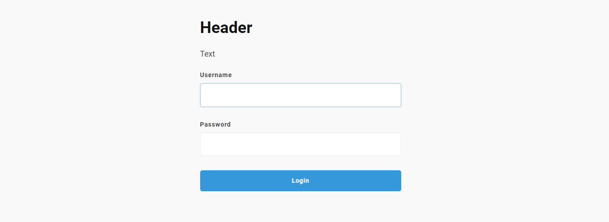

# Login and Register

Umbraco Uno offers a couple of widgets to setup member registration and access. This articles presents an overview of the two widgets, Register and Login. To learn more about how to setup and restrict member access on an Umbraco Uno website, read the [Members](link) article.

## Register

This widget lets you create an element on your page, where people can register for an account on your website.
They will register by filling out the fields, which are Name, Email, and Password, and finalizing by pressing the Register button. After doing that they will get a message saying that their sign up was successful.

In the backoffice you will be able to see your registerd members by clicking onto the Members tab. Here you can edit members and view how many members you have.

## Sample

## Configuration Options

- Header
- Text
- Image
- Background Color
- Text Color
- Success Message Heading (This is the heading of the message that displays after a member has successfully been created)
- Success Message Text (This is the message that displays after a member has successfully been created)

## Login

The Login Widget allows the member that was created, using The Register Widget to login to their account.

It is worth to note that The Login Widget, also works for members that were created by the admins in the backoffice.

## Sample

## Configuration Options

- Heading
- Text
- Image
- Background Color
- Text Color
- Redirect URL (This is where you decide where the members are redirected to after they log in)

:::note
When the Login widget is added to a page, whenever that page is loaded it will default to show the login form.

This means that even if the Login widget is added as the bottom widget on a page, the frontend will be automatically be *scrolled* down to show the login form as the first thing.
:::
