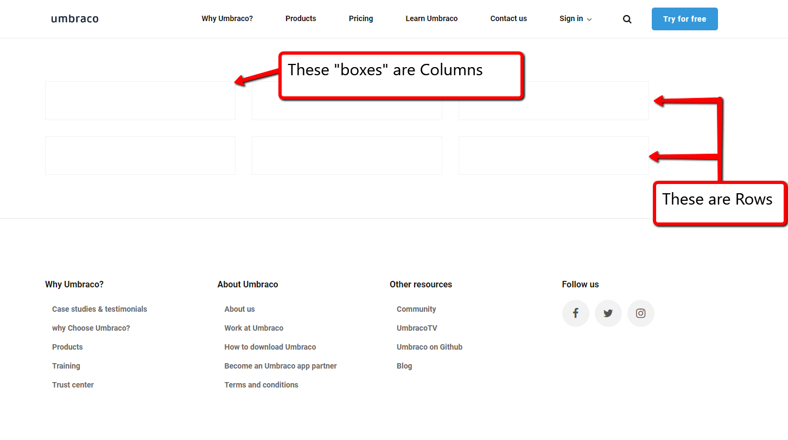

# The Grid

The Grid Widget lets you set up a framework of widgets and you will have the ability to make it look the way you want. 

When you add the Grid widget you get to set up the general look of the grid, and choose what widgets you want it  to contain.

## Rows

A Row is a kind of shelf for the columns in the grid, and each row has a total column width of 100%. Say you wanted three columns on your row each of these would have to have a column width of 33%.

## Columns

Columns are the boxes wherein you create your content when working in a grid. Most of the grid widgets require you to set a column width. This is because it sets the width for how big the box will be and by that determine how many consecutive columns can be in a row.

## Using the Grid

It can be very beneficial to be using a grid because it makes sure that everything stays in the alignment that you have set up for the grid.
The grid is good for multiple reasons. It keeps your page-aligned beautifully and also provides you with a lot of great tools such as Navigation or Line break.

## Configuration options

These are the options you will have to customize your grid, each of these options plays an important part in making your grid exactly how you like it.

- Alias
- Container Width
- Remove Column Gutter
- Compact
- Horizontal Align Columns
- Vertical Align Columns
- Background Image - This lets you add a background image to the entire grid.
- Background Color - This lets you add a background color to the entire grid.
- Text Color - This lets you change the text color in your grid.
- Animate - This gives your grid an animation that makes it fade into view when the user arrives at the grid.

## Setting up your grid

Making a good looking grid comes through a few steps.
The first step would be to set up an ***Alias*** because this lets you distinguish each grid from one and other. The next step is choosing ***Container Width*** with this option you can select how big you want your grid to be.
With both ***Horizontal Align Columns*** and ***Vertical Align Columns*** you can make sure your columns are aligned the way you would like.
To make your columns look how you would like them to, both ***Compact*** and ***Remove Column Gutter*** allows you to make changes to your column box.
Finally, you have some design options with ***Background Image***,***Background Color***,***Text Color*** and ***Animate***, with these you can change the look of your entire grid by adding a background color or image with a specific color text, and make your grid fade into view.

## Presentation widgets

These widgets are tools to make your grid as nice look as possible, each of them offers unique functionality, that in some way has the potential to improve the overall look of your grid.

- [Header](Header/index.md)
- [Text](Text/index.md)
- [Navigation](Navigation/index.md)
- [Line break](Line-break/index.md)
- [Sub grid](Sub-grid/index.md)
- [Slider](Slider/index.md)
- [Button](Button/index.md)

## Content widgets

These widgets are tools to help you get your desired content shown in the best possible way, each of them offering unique functionalities to display content.

- [Accordion](Accordion/index.md)
- [Quote](Quote/index.md)
- [Code](Code/index.md)
- [Price list](Price-list/index.md)
- [Price table](Price-table/index.md)
- [Umbraco Form](Umbraco-Form/index.md)
- [Pod](Pod/index.md)
- [Card](Card/index.md)

## Media widgets

These are great tools for adding media to your grid in a manageable fashion. Please note that video files needs to be MP4.

- [Video](Video/index.md)
- [Image](Image/index.md)
