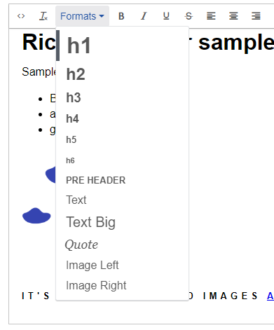

# Rich Text Editors

Many options to add text to an Umbraco Uno project provides to option to add the text as *rich text* through a so called Rich Text Editor.

The Rich Text Editor provides the option to add additional formatting and styling to otherwise plane text fields. Customize the text with options such as italics and bold or organize longer sections using unordered or ordered bullet lists.

The image above provides an example of how the Rich Text Editor looks in the Umbraco backoffice. The sample content that has been added in the sample, will be shown more or less the same on the frontend.

:::tip
An editor like the Rich Text Editor is also often refered to as a "What you see is what you get"(WYSIWYG) editor.
:::

This article provides an overview of the various formatting and styling options provided by the Rich Text Editor.

## Formats

Each Rich Text Editor in Umbraco Uno provides a set of pre-defined text formats. These can be accesed by selecting the "Formats" dropdown in the Rich Text Editor toolbar.

The pre-defined formats include 6 different heading sizes, specific styling for quote elements and for big text.

When adding images through the Rich Text Editor, the image will by default be added on a new line. Use the *Image Left* or *Image Right* format options to place image in the same line as the text.

### Adding formatting

Applying a pre-defined format to a piece of text can be achieved in one of two ways:

* Select/highlight a piece of text (or place the cursor on the text) that has already been added and choose the wanted format from the dropdown list, or
* Select the wanted format from the dropdown list and then start adding the text.

### Clear formatting

In some cases it might become necessary to remove the formatting that has been added to a line or section of text. This can be done by using the *Clear formatting* option which is to the left of the "Formats" dropdown in the Rich Text Editor toolbar.

* Select/highlight the text where the formatting needs to be cleared (or place the cursor )

## Font styles

## Alignment and indentations
