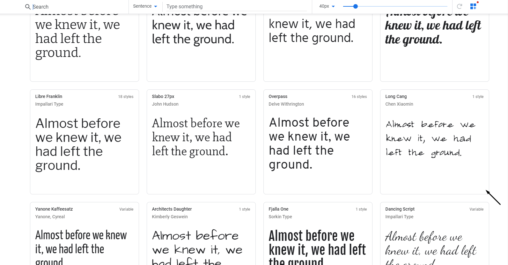
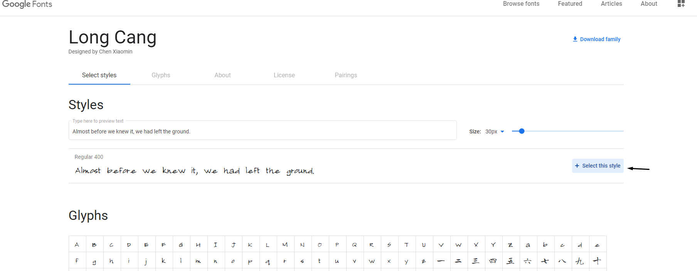
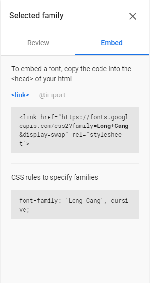

# How to add a new font style through the backoffice

If you find yourself in need of a font that is not already included in Umbraco Uno, then you have the option to add one yourself. In this article, you will learn how to do that.

What you will have to do is to go to [Google Fonts](https://fonts.google.com/) select a font you like and click the box.

After clicking the box, you will be presented with a list of versions of the style. You can select one of them or all of them. To select them, you click **+ select this style** on the style that you want.

A window will slide in from the right, and from here, select embed. If you do not see the slide in the window, you can press the button in the top right looking like this:

:::Center

:::

When you click embed, there will be two boxes. The fist box will be a link you have to copy.

:::Center

:::

Go to your Theme settings page in the Umbraco Uno backoffice, navigate to the **Embed Font** field and paste in the link. After this is done. Now you can add new fonts to the body font and the heading font fields. It is possible to choose a different font for the header and body.

The way you add the header and body font is to type in the name of the font.

## How to change the font using the Theme Editor

To change the font using the [Theme Editor](../../Getting-Started/Themes/index.md), you will have to go to a preview page of your site and click the green paintbrush button on the right side.
From there, go to the Text tab and select the fonts you want.
