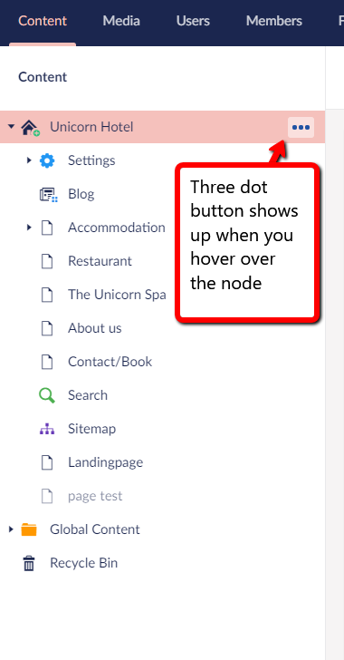

# Content Template

Umbraco Uno offers the option to make a template of your page, to get a nice work process, so that you won't have to set the same page up multiple times.

## What is a Content Template

A Content Template, lets you create a page containing a set up of widgets.
This is a very useful feature as it allows you to have some predefined templates to choose from.

## How to set it up

Setting up your template comes in two parts - first you need to make a page that has the widgets you want, and then turn that into a template.

### Setting up the widgets of the page

Start by setting up the page with some widgets.
You can read more about [Widgets](../../Uno-pedia/Widgets/index.md) in the Uno-pedia section.

1. Click the context menu on your home node (***...***) and select the page
2. Name the page
3. Add the Widgets you want in your template and set it up how you like it

:::note It is recommended to not fill out the widgets, because if you do, then you will have to delete the content you don't want each time you use the template.:::

### Making the Content Template

Now that we have a page that we want to use for our template.

1. Click the (***...***) button in the tree at the page, you created in the steps above

2. Select ***Do something else***
3. On the list choose ***Create Content Template***
4. Choose the name you want for your template and click ***Create***
5. Now if you go to create a new page, the template you made earlier in this guide will be there as an option