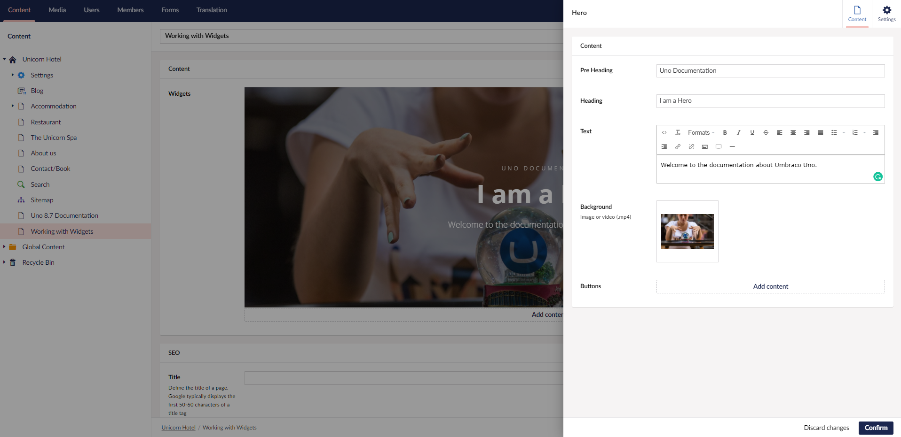
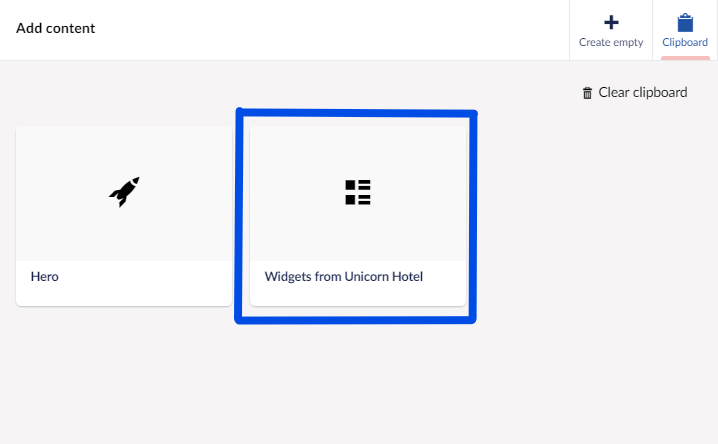

# Working with widgets

Widgets are the building blocks used to create and customize Umbraco Uno websites. There is [a long list of available widgets](../../Widgets), all tailored to specific purposes ranging from static text fields to elaborate grid structures.

Being the main way to add content to pages, widgets are available on the following content types:

* Start
* Page
* Feed
* Global Content
* Search

Contents of this article:

* [Adding a widget](#adding-a-widget)
* [Copying widgets](#copying-widgets)
* [Re-ordering widgets](#re-ordering-widgets)
* [Remove widgets](#remove-widgets)

## Adding a widget

Widgets are added in the *Content* group which can be found on the *Content tab* on each of the content types listed above.

To add a widget, follow these steps:

* Click **Add Content**
* Select a widget from dialog opening on the right-hand side

  

* This will open a new window with configuration options
* Add your content and data to the fields on the **Content** tab
* Choose configuration options on the **Settings** tab
* Click **Confirm** in the bottom right to add the widget to your page

When you are using a larger screen, you will see that a preview of the widget you are creating will update as you add content and configuration. This preview will show you how the widget will look on your frontend once you save the page.

:::tip
Find links to articles describing each available widget in the [Widgets](../../Widgets) article.
:::

To edit a widget after it has been configured and added to a page, click on it directly in the dashboard or select the little cog wheel that will appear in the top-right corner once you hover the widget.

## Copying widgets

Once a widget has been added and configured, it becomes possible to create a copy of that widget. This copy will include all filled in data as well as maintain the selected configuration options.

To **copy a widget**, follow these steps:

* Use the mouse to hover over the widget that needs to be copied
* Click on the **copy** icon in the top-right corner of the widget - this will add the widget to the **clipboard**
* Navigate to the page where you want a copy of the widget
* Select **Add content**
* In the dialog, navigate to the **Clipboard** tab in the top-right corner

  

* Select the widget copied from the other page
* A copy of the widget (including data and configuration) will be added to the current page

To **copy multiple widgets**, follow these steps:

* Hover over the Widgets section of the page from where the widgets should be copied
* Click on the elipses (...)
* Select **Copy widgets** - this will add all widgets from the page to the clipboard
* Navigate to the page where you want a copy of the widgets
* Select **Add content**

  

* The clipboard will now show a group of widgets containing a copy of all widgets from the specific page (in this case "Widgets from Unicorn Hotel")
* Select the group of widgets
* All widgets (including data and configuration) will be pasted into the current page

It is possible to have multiple copies and groups in the clipboard at the same time.

In order to clear the clipboard, click on the **Clear clipboard** icon in the top-right corner of the section.

:::note
Widgets that are copied in this way, will have no relation to each other. This means that once a widget has been copied, and the original is changed, the copies will not be updated to reflect those changes.

In order to create a set of widgets that can be used on multiple pages, while only needing to be maintained one place, use [Global Content](../../Uno-pedia/Content-Types/Global-Content)
:::

## Re-ordering widgets

Sometimes it might become necessary to re-arrange the order of widgets added to a page. This can be done by clicking and dragging the widgets around.

* Click and hold the widget that needs to be moved
* Drag the widget to where it should be in the list
* Let go of the widget
* Save and/or publish the page in order for the changes to be reflected

## Remove widgets

In some cases it might be needed to remove one or more widgets from a page. This can be done by either removing all widgets from a page or removing the widgets one by one.

To **remove a single widget**, follow these steps:

* Use the mouse to hover over the widget that needs to be removed
* Select the *trashcan* icon in the top-right corner
* Confirm the action by selecting **Delete** in the pop-up dialog
* The widget will be removed from the page
* Save and/or publish the page in order for the changes to be reflected

To **remove all widgets on a page**, follow these steps:

* Use the mouse to over the Widgets section on the page where all widgets needs to be removed
* Click on the elipses (...)
* Select **Remove all items**
* Confirm the action by selecting **Delete** in the pop-up dialog
* All widgets will be cleared from the page
* Save and/or publish the page in order for the changes to be reflected

:::warning
It's recommended that the delete actions be used with caution as deleted widgets cannot be recovered.
:::
