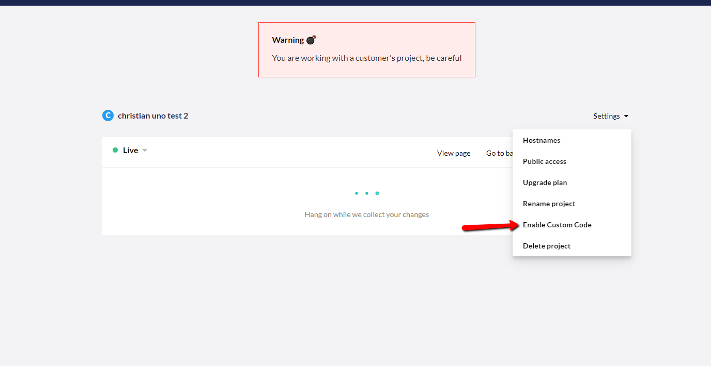
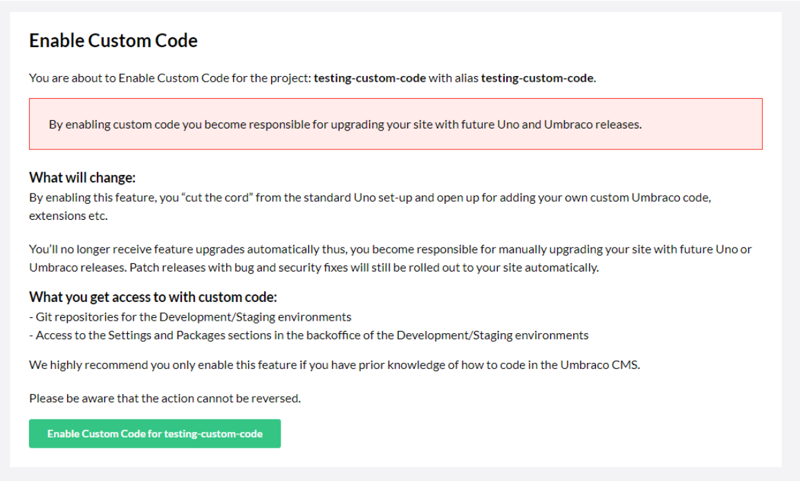

# Custom Code

In Umbraco Uno, it is possible to enable Custom Code, if you are on a Standard or Professional plan. Enabling custom code will give you the opportunity you to extend on the functionality and features that Umbraco Uno provides.

:::warning
Please be aware that by enabling custom code you also agree to the following changes in your project and subscription:

* You will **no longer be entitled to support** through your Umbraco Uno subscription
* The project will **no longer receive Umbraco Uno related updates**
* The Sendgrid implementation will be removed, meaning that you will have to [manually set up your own mail integration](../../Umbraco-Cloud/Set-Up/SMTP-settings/index.md) 
:::

## Enable custom code

The way you activate this feature is very straight forward:

1. Navigate to your project in the portal

2. Go to settings

3. Select ***Enable Custom Code***

4. You will be taken to a new page with a disclaimer, telling you that once you enable custom code you cannot turn it off again.

5. If you are sure you want to enable custom code then go ahead and click the green button saying ***Enable Custom Code***

After Enabling Custom code, you will be able to enter the settings section and the packages section on your Development and Staging environments(not on live).
Furthermore, you will gain access to Git for Development and Staging which will enable you to clone the environments to your local machine.
If you decide to clone your Umbraco Uno Project down locally, it is important that you keep the domain as it is (localhost:), because if you change it, that will potentially lead to issues with our license checker.
