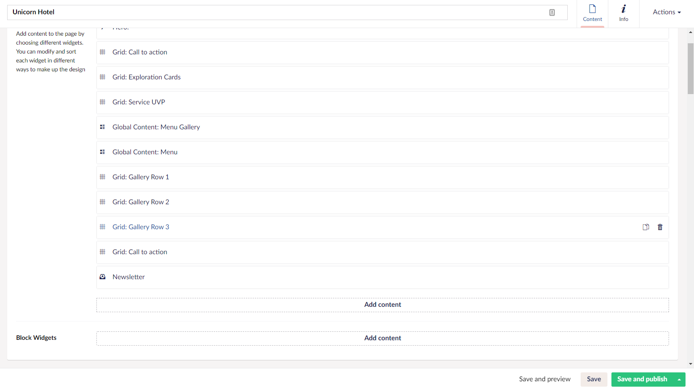
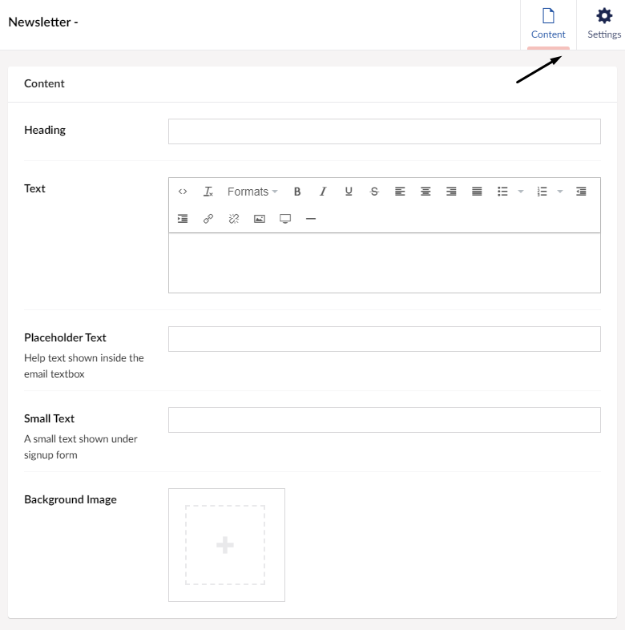

# Converting to new widgets

Suppose you have an Uno project that your project was created before September 10th 2020. Then you will have to upgrade your widgets manually from the old widgets to the new widgets.
In this guide, you will find everything you need to make that upgrade.

## How do you Convert from old to new

The move from the old widget format to the new is manual. You will need to create the content of each widget again in the new format. And there’s a specific approach to it.

How do you do it? On each page of your Uno side, the list of your “old” widgets will still be here. If you scroll down on the page, you will see a new field below widgets that say ***Block Widgets***. This is where you will be re-creating your widgets in the new block format. However, you will have to start from the bottom of your widget list, moving towards the top of the list to have everything look as it did before.

As an example, in the picture above, the newsletter is the lowest widget in the list. Therefore you need to create that one as the first in the ***Block Widgets***. 

:::tip
The old and the new widgets are called the same, making it easy for you to find the new widget that matches the content and look of the old
:::

Like this:

1. Add the newsletter widget to the ***Block Widgets*** list
2. Give it the same set-up as in the old widget
3. Delete the old newsletter widget 
4. Move on to the next widget, in this case, that would be Grid: Call to action

## The new block widgets

The new ***Block Widgets*** function a bit different than what you are used to in that you will have two options when setting them up. You will find these after selecting the widget. A window will then slide in from the right and in the top right corner of the window that slid in. You will have content and settings, as shown in the image below.

This is because all the settings used to be on the same page of a widget. However, in the new block widgets they have now been split up into two sections to give you a better overview.
